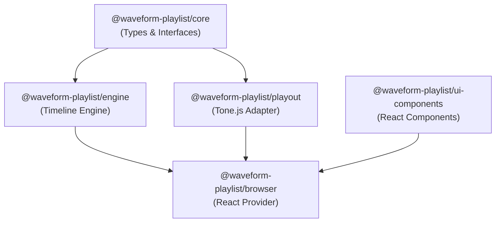
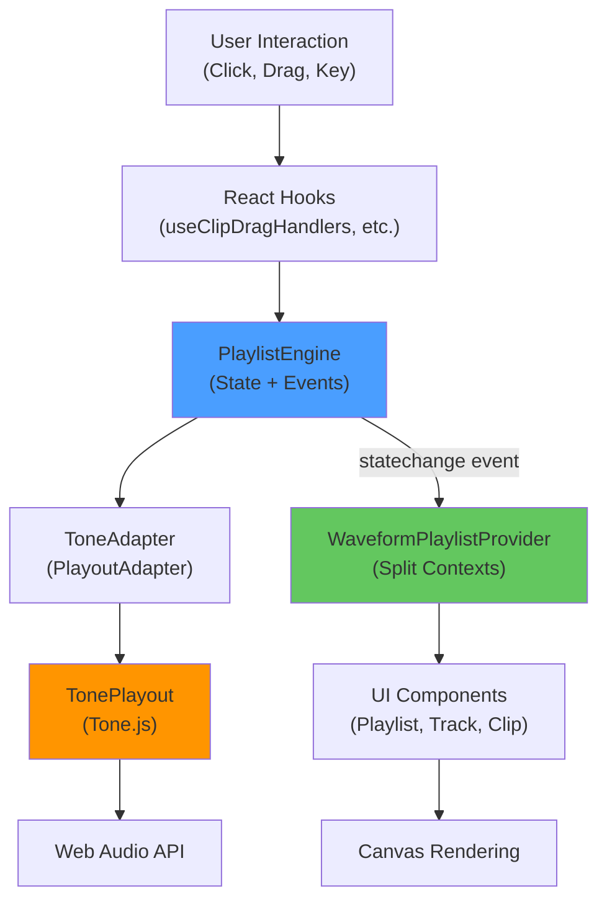

# Architecture

Waveform Playlist is built as a **modular monorepo** designed for flexibility, tree-shaking, and framework-agnostic reuse.

## Monorepo Structure

The project uses pnpm workspaces to organize packages by responsibility:

```
waveform-playlist/
├── packages/
│   ├── core/              # Pure TypeScript types & interfaces
│   ├── engine/            # Framework-agnostic timeline engine
│   ├── playout/           # Tone.js audio playback adapter
│   ├── browser/           # React provider, hooks, components
│   ├── ui-components/     # Reusable React UI components
│   ├── webaudio-peaks/    # Waveform peak generation
│   ├── loaders/           # Audio file loaders
│   ├── annotations/       # Optional annotation support
│   ├── recording/         # Optional audio recording
│   ├── spectrogram/       # Optional FFT visualization
│   └── media-element-playout/  # HTMLAudioElement streaming
└── website/               # Docusaurus documentation
```

## Core Package Architecture

### Package Dependencies

The dependency graph ensures clean separation of concerns:

<Tip>
All packages depend on `@waveform-playlist/core` for shared types, but core has **zero dependencies**.
</Tip>



### Package Descriptions

#### `@waveform-playlist/core`

**Purpose:** Pure TypeScript types and interfaces with zero dependencies

**Key Exports:**
- `AudioClip`, `ClipTrack`, `Timeline` interfaces
- `createClip()`, `createClipFromSeconds()` factory functions
- Fade types: `Fade`, `FadeType`
- Peak data types: `Peaks`, `PeakData`, `Bits`

**Why Pure Types:** Enables type-checking without bundling framework code

#### `@waveform-playlist/engine`

**Purpose:** Framework-agnostic stateful timeline engine

**Key Exports:**
- `PlaylistEngine` class (event emitter + state management)
- `PlayoutAdapter` interface (pluggable audio backend)
- Pure operations functions (clip drag, trim, split, zoom)

**Architecture:** Two-layer design
1. **Pure operations** (`operations/`) - Stateless constraint functions
2. **Stateful engine** - Composes operations with events

**No Framework Dependencies:** Can be used with Svelte, Vue, or vanilla JS

#### `@waveform-playlist/playout`

**Purpose:** Tone.js audio playback implementation

**Key Exports:**
- `TonePlayout` class (Tone.js wrapper)
- `createToneAdapter()` factory (bridges engine to Tone.js)
- Global AudioContext management

**Why Tone.js:** 
- Professional scheduling with Transport API
- Built-in effects system
- Sample-accurate timing

#### `@waveform-playlist/browser`

**Purpose:** React integration layer

**Key Exports:**
- `WaveformPlaylistProvider` (React Context provider)
- Custom hooks (`usePlaylistControls`, `usePlaylistData`, etc.)
- Primitive components (`PlayButton`, `ZoomInButton`, etc.)

**Pattern:** Flexible provider + primitives architecture

#### `@waveform-playlist/ui-components`

**Purpose:** Reusable styled React components

**Key Exports:**
- `Playlist`, `Track`, `Clip` components
- `TimeScale`, `Playhead`, `Selection` overlays
- Theme system (`WaveformPlaylistTheme`, `defaultTheme`)

## Data Flow Architecture

Waveform Playlist uses a **unidirectional data flow** with React Context and an event-driven engine:



### Engine State Ownership

The `PlaylistEngine` owns these state slices:

- **Selection:** `selectionStart`, `selectionEnd`
- **Loop region:** `isLoopEnabled`, `loopStart`, `loopEnd`
- **Zoom:** `samplesPerPixel`, `canZoomIn`, `canZoomOut`
- **Master volume:** `masterVolume`
- **Selected track:** `selectedTrackId`
- **Tracks:** `tracks[]` (for clip mutations: move, trim, split)

<Warning>
React state does NOT own these values. The provider subscribes to engine `statechange` events and mirrors values into React state/refs using the `onEngineState()` hook pattern.
</Warning>

### React State Ownership

React owns these state slices:

- **Playback timing:** `isPlaying`, `currentTime` (60fps animation loop)
- **UI-only state:** `continuousPlay`, `annotationsEditable`, `isAutomaticScroll`
- **Annotations:** `annotations[]`, `activeAnnotationId`

### Split Context Pattern

The provider uses **4 separate contexts** to optimize performance:

#### 1. PlaybackAnimationContext (60fps)

High-frequency updates, only animation subscribers:

```typescript
interface PlaybackAnimationContextValue {
  isPlaying: boolean;
  currentTime: number;
  currentTimeRef: React.RefObject<number>;
  getPlaybackTime: () => number;
}
```

#### 2. PlaylistStateContext (User Interactions)

State that changes on user actions:

```typescript
interface PlaylistStateContextValue {
  selectionStart: number;
  selectionEnd: number;
  isLoopEnabled: boolean;
  loopStart: number;
  loopEnd: number;
  selectedTrackId: string | null;
  annotations: AnnotationData[];
  // ... more UI state
}
```

#### 3. PlaylistControlsContext (Stable Functions)

Doesn't cause re-renders when accessed:

```typescript
interface PlaylistControlsContextValue {
  play: (startTime?: number, duration?: number) => Promise<void>;
  pause: () => void;
  stop: () => void;
  setSelection: (start: number, end: number) => void;
  zoomIn: () => void;
  zoomOut: () => void;
  // ... more controls
}
```

#### 4. PlaylistDataContext (Static/Infrequent)

Changes rarely after initialization:

```typescript
interface PlaylistDataContextValue {
  duration: number;
  audioBuffers: AudioBuffer[];
  peaksDataArray: TrackClipPeaks[];
  sampleRate: number;
  samplesPerPixel: number;
  // ... more static data
}
```

<Check>
**Why Split?** Prevents unnecessary re-renders. Checkboxes don't re-render during 60fps animation because they only subscribe to `PlaylistControlsContext` and `PlaylistStateContext`.
</Check>

## Sample-Based Architecture

<Tip>
All timing is stored as **integer sample counts**, not floating-point seconds.
</Tip>

This architectural decision eliminates floating-point precision errors:

```typescript
interface AudioClip {
  startSample: number;        // Position on timeline (samples)
  durationSamples: number;    // Clip duration (samples)
  offsetSamples: number;      // Trim start position (samples)
  sampleRate: number;         // Required for time conversion
}
```

### Benefits

✅ **Perfect pixel alignment** - No 1-pixel gaps between clips  
✅ **Mathematically exact** - All calculations use integers  
✅ **No precision loss** - Converting between time/samples/pixels  
✅ **Predictable rendering** - Sample boundaries align with pixels

### User-Facing API

Users can still work with seconds:

```typescript
const clip = createClipFromSeconds({
  audioBuffer,
  startTime: 5.0,    // Converted to samples internally
  duration: 10.0,
  offset: 2.5,
});
// Internally: startSample, durationSamples, offsetSamples
```

## Provider Pattern

The flexible provider pattern enables custom layouts:

```typescript
import {
  WaveformPlaylistProvider,
  PlayButton,
  StopButton,
  Waveform,
  usePlaylistData,
} from '@waveform-playlist/browser';

function MyApp() {
  return (
    <WaveformPlaylistProvider tracks={tracks} samplesPerPixel={1024}>
      <div className="my-layout">
        {/* Controls can be placed anywhere */}
        <div className="controls">
          <PlayButton />
          <StopButton />
        </div>
        
        {/* Waveform can have custom track controls */}
        <Waveform renderTrackControls={(trackIndex) => (
          <CustomControls trackIndex={trackIndex} />
        )} />
      </div>
    </WaveformPlaylistProvider>
  );
}
```

<Check>
**Maximum Flexibility:** Place controls anywhere in your layout while maintaining full type safety.
</Check>

## Build System

### Package Builds

Each package builds independently with **tsup**:

```bash
pnpm build  # Builds all packages
```

Output per package:
- `dist/index.js` (CommonJS)
- `dist/index.mjs` (ES Modules)
- `dist/index.d.ts` (TypeScript types)

### Tree-Shaking Support

All packages export ES Modules for optimal tree-shaking:

```json
{
  "exports": {
    ".": {
      "import": "./dist/index.mjs",
      "require": "./dist/index.js",
      "types": "./dist/index.d.ts"
    }
  }
}
```

## Next Steps

<CardGroup cols={2}>
  <Card title="Tracks & Clips" icon="layer-group" href="/concepts/tracks-and-clips">
    Learn about the clip-based editing model
  </Card>
  <Card title="Audio Engine" icon="wave-square" href="/concepts/audio-engine">
    Understand the Tone.js integration
  </Card>
  <Card title="Theming" icon="palette" href="/concepts/theming">
    Customize the visual appearance
  </Card>
  <Card title="API Reference" icon="code" href="/api/providers/waveform-playlist-provider">
    Explore the complete API
  </Card>
</CardGroup>
