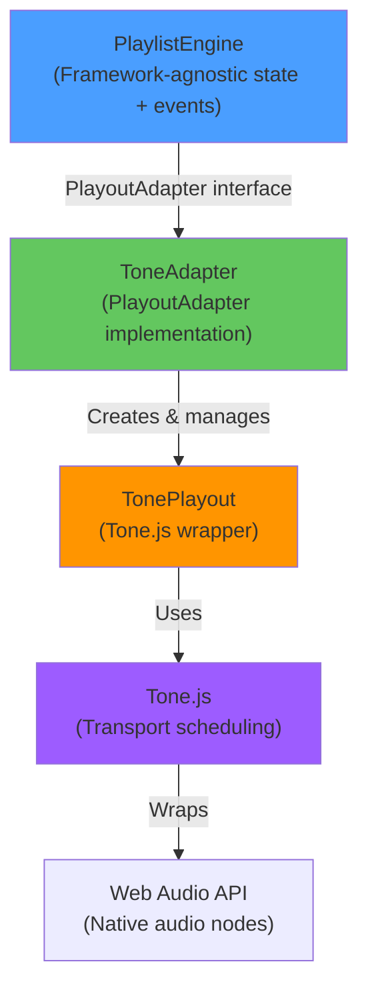
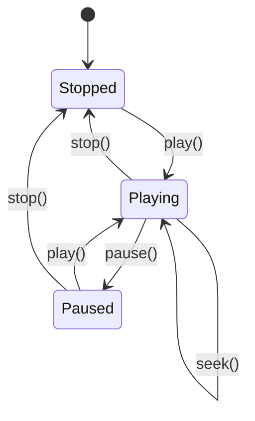

# Audio Engine

Waveform Playlist uses a sophisticated audio engine built on **Tone.js** for professional-grade scheduling, effects, and playback.

## Architecture Overview

The audio system has three layers:



## PlaylistEngine

The `PlaylistEngine` is a **framework-agnostic** stateful class that manages timeline state and delegates audio to a pluggable adapter.

### Key Responsibilities

- ✅ Track state (clips, mute, solo, volume, pan)
- ✅ Playback control (play, pause, stop, seek)
- ✅ Selection & loop regions
- ✅ Zoom levels
- ✅ Clip editing (move, trim, split)
- ✅ Event emission (`statechange`, `play`, `pause`, `stop`)

<Info>
The engine has **zero React dependencies**. It can be used with Svelte, Vue, or vanilla JavaScript.
</Info>

### Engine State

The engine exposes a complete state snapshot:

```typescript
interface EngineState {
  tracks: ClipTrack[];
  tracksVersion: number;         // Increments on clip mutations
  duration: number;
  currentTime: number;
  isPlaying: boolean;
  samplesPerPixel: number;
  sampleRate: number;
  selectedTrackId: string | null;
  zoomIndex: number;
  canZoomIn: boolean;
  canZoomOut: boolean;
  selectionStart: number;
  selectionEnd: number;
  masterVolume: number;
  loopStart: number;
  loopEnd: number;
  isLoopEnabled: boolean;
}
```

### Creating an Engine

```typescript
import { PlaylistEngine } from '@waveform-playlist/engine';
import { createToneAdapter } from '@waveform-playlist/playout';

const adapter = createToneAdapter({ effects });
const engine = new PlaylistEngine({
  adapter,
  samplesPerPixel: 1024,
  zoomLevels: [256, 512, 1024, 2048, 4096],
  sampleRate: 44100,
});

// Set tracks
engine.setTracks(tracks);

// Subscribe to state changes
engine.on('statechange', (state: EngineState) => {
  console.log('New state:', state);
});

// Control playback
await engine.init();  // Resume AudioContext
engine.play();
```

## TonePlayout

The `TonePlayout` class wraps Tone.js for audio playback using native `AudioBufferSourceNode` + `Transport.schedule()`.

### Why Tone.js?

✅ **Sample-accurate scheduling** via Transport API  
✅ **Built-in effects system** (20+ effects available)  
✅ **Loop support** with automatic wrapping  
✅ **Global AudioContext** management  
✅ **Cross-browser compatibility** via `standardized-audio-context`  

### Transport Scheduling

<Tip>
Tone.js `Transport` provides a **musical timeline** that stays in sync with the audio clock, even during playback speed changes.
</Tip>

Instead of using `Player.sync()` (which has timing drift issues), we use:

```typescript
// Schedule clip to play at 5 seconds on the timeline
Transport.schedule((time) => {
  // Create native AudioBufferSourceNode
  const source = context.createBufferSource();
  source.buffer = clip.audioBuffer;
  source.connect(fadeGainNode);
  source.start(time, clipOffsetSeconds, clipDurationSeconds);
  
  // Track active source for cleanup
  activeSources.add(source);
}, clipStartTimeSeconds);
```

**Benefits:**

- ✅ Permanent timeline events (re-fire on loop iterations)
- ✅ Sample-accurate timing (no drift)
- ✅ Native `AudioBufferSourceNode` (no Tone.js Player overhead)
- ✅ Direct control over offset and duration

### Audio Graph (Per Clip)

Each clip has its own audio chain:

```
AudioBufferSourceNode (native, one-shot, created per play/loop)
  → GainNode (native, per-clip fade envelope)
  → Volume.input (Tone.js, shared per-track)
  → Panner (Tone.js, shared per-track)
  → muteGain (Tone.js, shared per-track)
  → effects chain (optional)
  → destination
```

<Check>
**One-shot sources:** Each play/loop iteration creates fresh `AudioBufferSourceNode` instances. Native sources can only be started once.
</Check>

### Mid-Clip Playback

When playback starts mid-clip, the system handles it automatically:

```typescript
// User seeks to 7 seconds
// Clip runs from 5s to 10s
// Transport.schedule(callback, 5s) won't fire (already passed)

// Solution: startMidClipSources() detects spanning clips
function startMidClipSources(transportOffset: number, audioTime: number) {
  clips.forEach(clip => {
    const clipStart = clip.startSample / sampleRate;
    const clipEnd = clipStart + (clip.durationSamples / sampleRate);
    
    // Is this clip currently playing?
    if (clipStart < transportOffset && clipEnd > transportOffset) {
      // Start source with adjusted offset
      const elapsedIntoClip = transportOffset - clipStart;
      const remainingDuration = clipEnd - transportOffset;
      
      const source = context.createBufferSource();
      source.buffer = clip.audioBuffer;
      source.start(
        audioTime,
        clip.offsetSamples / sampleRate + elapsedIntoClip,
        remainingDuration
      );
    }
  });
}
```

## Loop Handling

Looping uses Tone.js Transport's native loop support:

```typescript
// Enable looping
engine.setLoopEnabled(true);
engine.setLoopRegion(5.0, 15.0);  // Loop 5s to 15s

// Internally:
Transport.loop = true;
Transport.loopStart = 5.0;
Transport.loopEnd = 15.0;
```

### Loop Event Handler

On each loop iteration, a special handler re-schedules clips:

```typescript
Transport.on('loop', () => {
  // Event fires BEFORE schedule callbacks
  // Order: loopEnd → ticks reset → loopStart → loop → forEachAtTime
  
  // 1. Stop old sources
  tracks.forEach(track => track.stopAllSources());
  
  // 2. Cancel fade envelopes
  tracks.forEach(track => track.cancelFades());
  
  // 3. Start mid-clip sources for clips spanning loopStart
  tracks.forEach(track => {
    track.startMidClipSources(loopStart, now());
  });
  
  // 4. Prepare fresh fade envelopes
  tracks.forEach(track => {
    track.prepareFades(now(), loopStart);
  });
  
  // Then Transport fires schedule callbacks for clips at/after loopStart
});
```

<Warning>
**Property Order Matters:** Always set `loopStart`/`loopEnd` BEFORE `loop = true`. The Transport checks `ticks >= loopEnd` every tick—if `loopEnd` is still 0, it wraps immediately.
</Warning>

### DAW-Style Loop Activation

Loops only activate when the playhead is **inside** the loop region:

```typescript
// User enables loop while playhead is at 20s
// Loop region is 5s - 15s
engine.setLoopEnabled(true);  // Doesn't activate Transport loop yet

// Playback continues to the end
engine.play();  // Plays from 20s to duration

// User seeks to 7s (inside loop)
engine.play(7);  // NOW Transport loop activates
```

<Info>
This matches professional DAW behavior (Logic, Ableton, Pro Tools) where loop regions don't force playback position.
</Info>

## Effects Chain

The engine supports both master and per-track effects:

### Master Effects

```typescript
import { createToneAdapter } from '@waveform-playlist/playout';
import { Reverb, Delay } from 'tone';

const adapter = createToneAdapter({
  effects: (masterVolume, destination, isOffline) => {
    const reverb = new Reverb({ decay: 2.0 });
    const delay = new Delay({ delayTime: 0.5 });
    
    masterVolume.connect(reverb);
    reverb.connect(delay);
    delay.connect(destination);
    
    // Cleanup function (optional)
    return () => {
      reverb.dispose();
      delay.dispose();
    };
  },
});
```

### Per-Track Effects

```typescript
import { createTrack } from '@waveform-playlist/core';
import { Chorus, Distortion } from 'tone';

const track = createTrack({
  name: 'Guitar',
  clips: [/* ... */],
  effects: (trackEnd, destination, isOffline) => {
    const chorus = new Chorus({ frequency: 1.5 });
    const distortion = new Distortion({ distortion: 0.8 });
    
    trackEnd.connect(chorus);
    chorus.connect(distortion);
    distortion.connect(destination);
    
    return () => {
      chorus.dispose();
      distortion.dispose();
    };
  },
});
```

<Tip>
The `isOffline` parameter indicates offline rendering (for WAV export). Use it to skip visual-only effects or adjust quality settings.
</Tip>

## Fade Envelopes

Fades are implemented using native `GainNode.gain` automation:

```typescript
function applyFadeIn(gainNode: GainNode, fadeIn: Fade, startTime: number) {
  const gain = gainNode.gain;
  gain.cancelScheduledValues(startTime);
  gain.setValueAtTime(0, startTime);
  
  const endTime = startTime + fadeIn.duration;
  
  switch (fadeIn.type) {
    case 'linear':
      gain.linearRampToValueAtTime(1, endTime);
      break;
    case 'logarithmic':
      gain.exponentialRampToValueAtTime(1, endTime);
      break;
    case 'exponential':
      gain.exponentialRampToValueAtTime(1, endTime);
      break;
    case 'sCurve':
      // S-curve using setValueCurveAtTime
      const curve = generateSCurve(256);
      gain.setValueCurveAtTime(curve, startTime, fadeIn.duration);
      break;
  }
}
```

<Check>
**Native AudioParam:** We use `GainNode.gain` directly (already an `AudioParam`) instead of Tone.js Signal wrappers for better performance.
</Check>

## Current Time Tracking

Playback position is tracked via `Transport.seconds`:

```typescript
// Get current playback time (auto-wraps at loop boundaries)
function getCurrentTime(): number {
  return Transport.seconds;
}

// In animation loop (60fps)
requestAnimationFrame(() => {
  const time = engine.getCurrentTime();  // Delegates to Transport.seconds
  updatePlayheadPosition(time);
});
```

<Info>
`Transport.seconds` automatically wraps at loop boundaries, so you don't need manual loop detection in the animation loop.
</Info>

## Global AudioContext

The playout package manages a single global AudioContext:

```typescript
import { getContext } from 'tone';

// Tone.js automatically creates and manages the context
const context = getContext();
console.log(context.sampleRate);  // 44100 or 48000
```

### Context Initialization

<Warning>
**User Gesture Required:** The AudioContext must be resumed after a user interaction (click, touch, key press).
</Warning>

```typescript
// First play requires init()
await engine.init();  // Calls Tone.start() internally
engine.play();

// Subsequent plays skip init
engine.play();  // No await needed
```

## Firefox Compatibility

The playout package uses Tone.js's `Context` class, which wraps `standardized-audio-context` for cross-browser compatibility:

```typescript
import { Context, setContext } from 'tone';

const context = new Context();
setContext(context);

// Now all Tone.js operations use the standardized context
// Works in Firefox without AudioListener or AudioWorklet errors
```

<Check>
**Cross-Browser:** This approach handles Firefox's non-standard `AudioListener` and `AudioWorkletNode` implementations automatically.
</Check>

## Playback State Machine

The engine tracks playback state:



### State Transitions

```typescript
// Stopped → Playing
engine.play(startTime?);
// - Resumes Transport
// - Starts animation loop
// - Emits 'play' event

// Playing → Paused
engine.pause();
// - Pauses Transport
// - Stops animation loop
// - Saves current position
// - Emits 'pause' event

// Playing/Paused → Stopped
engine.stop();
// - Stops Transport
// - Returns to playStartPosition (Audacity-style)
// - Stops animation loop
// - Emits 'stop' event
```

<Info>
**Audacity-Style Stop:** The stop button returns the cursor to where playback started, not to the timeline beginning.
</Info>

## Selection Playback

Play only a selected region:

```typescript
// Set selection
engine.setSelection(5.0, 10.0);

// Play selection
const start = engine.getState().selectionStart;
const end = engine.getState().selectionEnd;
const duration = end - start;

engine.play(start, duration);
// Plays from 5s to 10s, then stops automatically
```

<Warning>
Selection playback **disables** Transport loop to prevent conflicts between selection boundaries and loop boundaries.
</Warning>

## Performance Considerations

### Rebuild Avoidance

The adapter uses a **rebuild-on-setTracks** pattern:

```typescript
// Clip operations update engine tracks
engine.moveClip(trackId, clipId, deltaSamples);
// - Updates internal tracks
// - Calls adapter.setTracks(updatedTracks)
// - Emits statechange with tracks

// Provider mirrors to parent
onTracksChange(state.tracks);
// Parent passes same reference back as prop

// Provider detects engine-originated tracks
if (tracks === engineTracksRef.current) {
  // Skip full rebuild (engine/adapter already have correct state)
  return;
}
```

<Check>
**Optimization:** Reference equality check (`===`) prevents full audio engine rebuilds when clips are moved/trimmed/split.
</Check>

### Worker-Based Peak Generation

Peak data is generated in a Web Worker to avoid blocking the main thread:

```typescript
// Worker generates WaveformData at base scale (256 samples/pixel)
const waveformData = await generateInWorker(audioBuffer, 256);

// Zoom changes use fast resample() (no worker needed)
const resampled = waveformData.resample({ scale: 1024 });
```

## Offline Rendering (WAV Export)

Export the timeline to a WAV file using Tone.Offline:

```typescript
import { Offline } from 'tone';

const buffer = await Offline(async ({ Transport }) => {
  // Set up tracks with effects (isOffline = true)
  const offlinePlayout = new TonePlayout({
    tracks: offlineTracks,
    effects: masterEffects,
  });
  
  // Schedule all clips
  offlinePlayout.play(0);
  
  // Wait for duration
  await Transport.start();
}, duration, 2, 44100);  // 2 channels, 44100 Hz

// Convert to WAV
const wav = audioBufferToWav(buffer);
const blob = new Blob([wav], { type: 'audio/wav' });
```

<Tip>
Pass `isOffline: true` to effects functions to skip visualization-only effects or increase quality settings for export.
</Tip>

## Next Steps

<CardGroup cols={2}>
  <Card title="Tracks & Clips" icon="layer-group" href="/concepts/tracks-and-clips">
    Learn about the clip-based model
  </Card>
  <Card title="Effects Guide" icon="wand-magic-sparkles" href="/guides/effects">
    Add audio effects to your tracks
  </Card>
  <Card title="Theming" icon="palette" href="/concepts/theming">
    Customize the visual appearance
  </Card>
  <Card title="API Reference" icon="code" href="/api/engine">
    Complete engine API documentation
  </Card>
</CardGroup>
